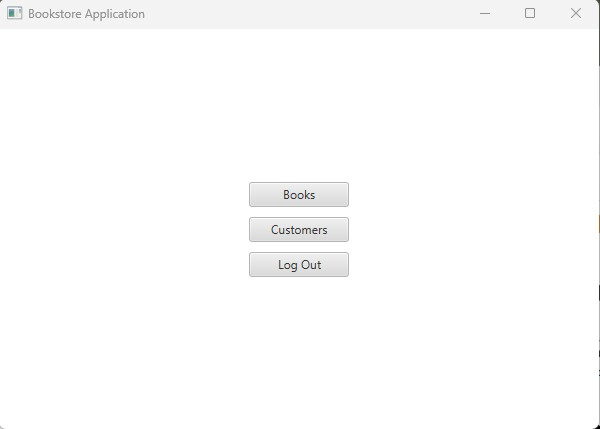
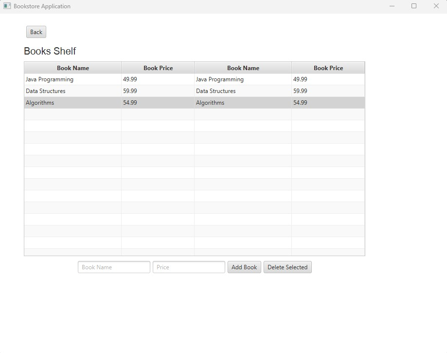
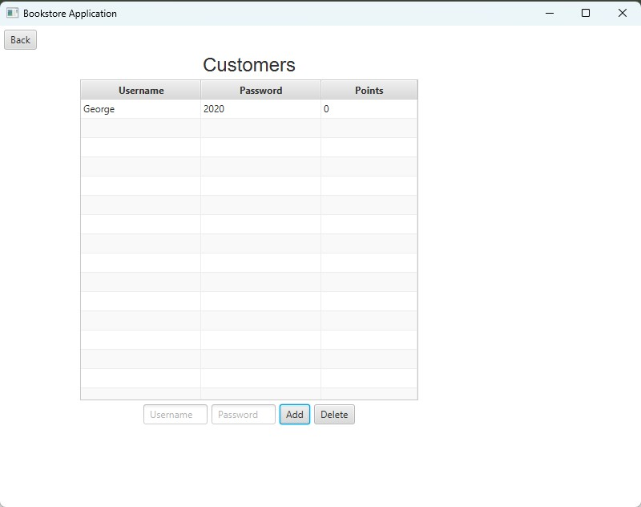

# Bookstore Application

A JavaFX-based desktop application for managing a bookstore with separate interfaces for owners and customers. This application supports book management, customer management, and a points-based loyalty system.

## Table of Contents

- [Features](#features)
- [Prerequisites](#prerequisites)
- [Installation](#installation)
- [Usage](#usage)
- [Project Structure](#project-structure)
- [Screenshots](#screenshots)

## Features

### Owner Features
- **Book Management**: Add, view, and delete books from the inventory
- **Customer Management**: Add and delete customer accounts
- **Data Persistence**: All data is saved to text files (`books.txt` and `customers.txt`)

### Customer Features
- **Browse Books**: View available books with prices
- **Purchase Books**: Buy books with standard payment
- **Points System**: Earn and redeem loyalty points
  - Earn 10 points per $1 CAD spent
  - Redeem 100 points for $1 CAD discount
- **Status Tiers**: 
  - Silver: Less than 1000 points
  - Gold: 1000+ points


### Running the Application

#### Using the Run Script:
```bash
./run.sh
```

Or on Windows:
```cmd
run.bat
```


## Project Structure

```
COE528-BookStore-Application/
├── images/                    # Screenshots and images
│   ├── login-screen.png
│   ├── owner-dashboard.png
│   └── ...
├── javafx-sdk-21.0.2/        # JavaFX SDK (download and extract here)
├── Book.java                  # Book entity class
├── BookStore.java             # Application state manager
├── BookstoreApp.java          # Main application class
├── Customer.java              # Customer entity class
├── Owner.java                 # Owner entity class
├── LoginScreen.java           # Login interface
├── OwnerStartScreen.java      # Owner main menu
├── OwnerBooksScreen.java      # Book management screen
├── OwnerCustomersScreen.java  # Customer management screen
├── CustomerStartScreen.java   # Customer main screen
├── CustomerCostScreen.java    # Purchase confirmation screen
├── FileManager.java           # File I/O operations
├── books.txt                  # Book data storage
├── customers.txt              # Customer data storage
└── run.sh                     # Run script (or run.bat for Windows)
```

**Note**: The `bookstoreapp/` folder contains compiled `.class` files that are automatically generated when you compile the source code. These files are not included in the repository and will be created during compilation.

## Screenshots

### Login Screen


The initial login interface where users authenticate.

### Owner Dashboard


Main menu for owners to access book and customer management.

### Book Management


Interface for adding and managing books in the inventory.

### Customer Management


Interface for managing customer accounts.


## Data Persistence

The application stores data in plain text files:
- `books.txt`: Contains book inventory (format: `BookName Price`)
- `customers.txt`: Contains customer accounts (format: `Username Password Points`)

Data is automatically saved when:
- Books are added or deleted
- Customers are added or deleted
- Customers make purchases

## Technical Details

- **Language**: Java
- **Framework**: JavaFX 21.0.2
- **Architecture**: MVC-like pattern with separate screen classes
- **Data Storage**: Plain text files
- **Package**: `bookstoreapp`

## Troubleshooting

### Application won't start
- Ensure JavaFX SDK is downloaded and extracted to `javafx-sdk-21.0.2/` directory
- Verify Java version is 11 or higher: `java -version`
- Check that all `.java` files are in the root directory
- Make sure the JavaFX SDK path in the run script matches your installation


**Note**: This application was developed as part of COE528 coursework. Users must download and install JavaFX SDK separately as it is not included in this repository.


